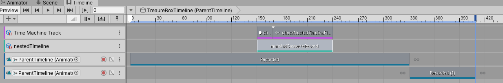

# Nested, generic Unity's Timeline flow control
a PoC of how to control the flow of any generic nested timelines inside a parent timeline, with the ability to control the parent timeline to continue only after the nested timeline has finished playing

### The scenario:
1. I have a locked box that can be opened by the player and upon its opening, the **"main (parent) timeline"** starts playing. This timeline is always the same.
2. I have different animation sequences, each for a cutscene containing different recorded audio clips and comic motions. When the player opens each locked box, a specific cutscene should be played.
3. the "main timeline" has 2 parts: the first part should start before the specific cutscene animation sequence, and the second part should start after the nested timeline has finished playing.

I could have solved this problem by creating various timeline assets for the main timeline, which controlled the nested timeline using ControlTrack. However, I decided to have only 1 timeline asset for my main timeline and create an script that could play a generic timeline instance and wait until it finished playing.

Here's a screenshot of the main timeline asset:

#### a) 
the "timeMachineTrack" controls the flow of the nested timeline and only allow the main timeline to advance if the nested timeline has finished playing
#### b)
the "nestedTimeline" Control Track is there so I can set the nested timeline as source gameobject for the control track at runtime. the clip within the track allows me to mark the time the nested timeline should start playing. I just have to instantiate the prefab of the nested timeline and set the source game object of the Control track and and it will start playing at the start of the clip (if the nested timeline is marked as "play on awake", of cource; otherwise you should call Play on the its playableDirector instance).

### The main logic:
```c#

    public void StartTimelineInstance()
        {
            // instantiate the nested timeline
            m_generatedNestedTimelineObject = Instantiate(m_nestedCassetteTimeline, transform);
            var nestedTimeline = m_generatedNestedTimelineObject.GetComponent<PlayableDirector>();
            nestedTimeline.stopped += (director) =>
            {
                // when the nested timeline finished playing, the parent is allowed to move forward the set marker
                timelineConditionMet = true;
                Destroy(m_generatedNestedTimelineObject);
            };
     
            // create parent timeline bindings
            foreach (var track in m_timelineDirector.playableAsset.outputs)
            {
                if (track.sourceObject is ControlTrack)
                {
                    ControlTrack ct = (ControlTrack)track.sourceObject;
                    if (ct.name == "nestedTimeline")
                    {
                        foreach (TimelineClip timelineClip in ct.GetClips())
                        {
                            ControlPlayableAsset playableAsset = (ControlPlayableAsset)timelineClip.asset;
                            playableAsset.postPlayback = ActivationControlPlayable.PostPlaybackState.Revert;
                            playableAsset.updateDirector = false;
                            playableAsset.updateParticle = false;
     
                            // set the reference of the nested timeline to the parent playable asset
                            m_timelineDirector.SetReferenceValue(playableAsset.sourceGameObject.exposedName, nestedTimeline.gameObject);
                            // rebind the playableGraph of the parent timeline director
                            m_timelineDirector.RebindPlayableGraphOutputs();
                        }
                    }
                }
            }
     
            // now I can play the timeline
            m_timelineDirector.Play();
        }
```
### Thanks to:
Unity's awesome tutorial, [A terrible kingdom](https://github.com/UnityTechnologies/ATerribleKingdom) which contains TimeMachine extension for timeline, which is the backbone of this repo,
and @darrencperry on Unity's forum, for the inspiration!!
